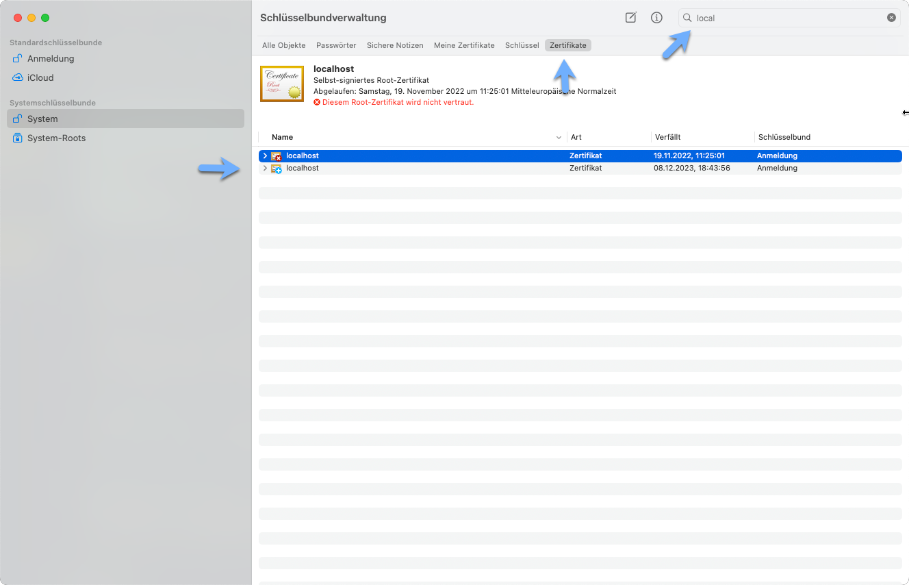
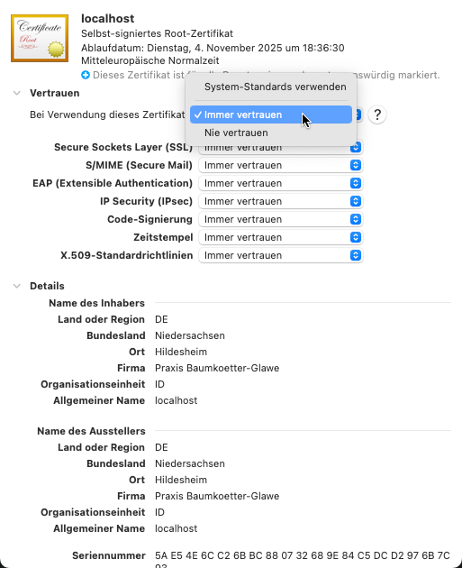

# Code Snippets from "the tiny monolith" project

Presented ad the AWS Hannover User Group


# The Tiny Monolith - Design Simplicity first

## AWS UserGroup Hannover

A single binary webapp with Go and HTMX.
Running for 3€/month on AWS t4g.nano

---


# The Tiny Monolith - Design Simplicity first

## A Use Case
## B Design Decisions
## C Simplicity


---


# A Use Case

## **A Use Case**
## B Design Decisions
## C Simplicity

___

# 1 UseCase: Forms for autistic testing


---

# 2 Goal / non functional requirements

## Non Functional
- Not often used

## Functional

- 10% Cost from classic AWS architecture
- Simple architecture
  - JS Frameworks are bloated
- Deployment < 10 seconds

### Personal

- Have fun with som new stuff, choose simplicity

---

# What would you choose?

> Topics / Decisions /Solutions


- Cost effective
- Simple as possible, 1..2 Developer
- Fast deployment
- 4 User/Month, but they have to be served fast

---


#  B Design Decisions

## A Use Case
## **B Design Decisions**
## C Simplicity

---
# Design decisions

## Infrastructure


## Software
## Testing
## Security
## IAC
## Deployment

---

# Design decisions

## **Infrastructure**


## Software
## Testing
## Security
## IAC
## Deployment

---

# Infrastructure


---


# Infrastructure Alternatives

<style scoped>
  h1 {

      margin: 0.5em 0 0;
      position: fixed;
      top: 0;
  }
</style>

- S3 Frontend / Lambda Backend
  - Lambda cold start
  - Decoupled brings complexity
- ALB/Container
  - No Cold start
  - Long deployment time
    (1..2 minutes)
  - ALB 40$/Month
- EC2 Tiny Monolith
  - Fast deployment (14 seconds), no cold start
  - Less complexity, less scalable


---

# The Reason we use container?

- Running on different environments
- One binary
- No cold start


---
# Same is achieved GO with FS/Embedding, but faster

<style scoped>
h1 {

    margin: 0.5em 0 0;
    position: fixed;
    top: 0;
}
</style>


<!-- footer: '* Docker & ECS Agent are written in GO'-->

---
<!-- footer: ""  -->

# Architecture comparism

Reason | Container | Tiny Monolith
-|-|-
Running on different environments | Yes | Yes
One binary  | Yes | Yes (embed.FS)
No cold start | Yes | Yes
Run locally | Yes | Yes
Fast deployment | It depends | Yes


---

# Architecture what about scaling?


- Scaling is not needed
- App can easily build on container
- Only session storage would move to Redis

> You dont have to build the APP for all possible futures,
> but you have to have a plan for some of them

---

# Architecture Whatif: move to container

```Dockerfile
FROM golang:1.11-alpine AS build-env
ADD . /src
RUN cd /src && go build -o air
FROM alpine
WORKDIR /app
COPY --from=build-env /src/goapp /app/
ENTRYPOINT ./air
```

or

```bash
CGO_ENABLED=0  GOOS=linux GOARCH=arm64 go build  -o ../dist/air main/main.go
```

```Dockerfile
FROM alpine
WORKDIR /app
COPY --from=build-env /dist/air /app/
ENTRYPOINT ./air
```

---

# Unpopular Opinion: YAGNI

- You ain't gonna need it

## A: Implement all possible futures
=> Overengineering
=> Customer did not paid for it
=> If basic functions are not working, customer is not happy

## B: Implement only what you need now
- Have a plan ready for the future
- Focus on essential functionality
=> Customer is happy
=> Customer pays for extensions later


---

# Design decisions

## Infrastructure


## **Software**
## Testing
## Security
## IAC
## Deployment

---

# Software


---


# Cocktail to Beer to Gin

<style scoped>
h1 {

    margin: 0.5em 0 0;
    position: fixed;
    top: 0;
}
</style>


>Gin is a HTTP web framework written in Go (Golang). It features a Martini-like API, but with performance up to 40 times faster than Martini. I

- More secure than apache/nginx: Only defined files are served
- More performant than NodeJS
- More tested than Streamlit (Pythons new kid on the block)
- More control than S3
- Crash-free: Panic Safe


---

# Gin Server


```go
	r.GET("/", routing.Index)
	...
	r.POST("/signin", routing.SignIn)
	...
	r.POST("/nextpage/:page", routing.NextPage)
```
```go
func Index(c *gin.Context) {
	sessionID := c.GetString(cookie.SESSION_ID_NAME)
	user := cookie.SessionStore[sessionID]
	myStatus := status.EmptyStatus()
	if user.LoggedIn {
		myStatus, err = status.UpdateStatus(c)
	}
	myStatus.LoggedIn = user.LoggedIn
	c.HTML(http.StatusOK, "index.html", myStatus)
	c.Next()
}
```

---

# Server and Sessions
<style scoped>
h1 {

    margin: 0.5em 0 0;
    position: fixed;
    top: 20px;
}
</style>


Store session in memory

---
<!-- 12 -->

# Simplistic Architecture: Go Templates


---

# Simplistic Architecture: One binary

## Define embed.FS
```go
import "embed"
var (
	//go:embed templates/*
	Templates embed.FS
)
```

## Use it
```go
r := gin.Default()
	tmplFS, _ := fs.Sub(static.Templates, "templates")
	tmpl := template.Must(template.New("").Funcs(funcMap).ParseFS(tmplFS, "*"))
	r.SetHTMLTemplate(tmpl)
```


---

# Web "frameworks"

## HTMX/Tailwind
- Simpler than React/Vue/Angular


---

#  htmx


>  htmx gives you access to AJAX, CSS Transitions, WebSockets and Server Sent Events directly in HTML, using attributes, so you can build modern user interfaces with the simplicity and power of hypertext

>  htmx is small (~14k min.gz’d), dependency-free, extendable & has reduced code base sizes by 67% when compared with react


---

<style scoped>
div.twocols {
  margin-top: 35px;
  column-count: 2;
}
div.twocols p:first-child,
div.twocols h1:first-child,
div.twocols h2:first-child,
div.twocols ul:first-child,
div.twocols ul li:first-child,
div.twocols ul li p:first-child {
  margin-top: 0 !important;
}
div.twocols p.break {
  break-before: column;
  margin-top: 0;
}
</style>

# Simplistic Architecture: HTMX
<div class="twocols">

## html
```html
{{ if .LoggedIn }}
<button
  id="button-test-1"
  hx-get="/test/aq-adult"
  hx-target="#content"
  hx-swap="outerHTML"
  >
  AQ Test
</button>
{{ else }}
```

<p class="break"></p>

## architecture


---


<style scoped>
div.twocols {
  margin-top: 35px;
  column-count: 2;
}
div.twocols p:first-child,
div.twocols h1:first-child,
div.twocols h2:first-child,
div.twocols ul:first-child,
div.twocols ul li:first-child,
div.twocols ul li p:first-child {
  margin-top: 0 !important;
}
div.twocols p.break {
  break-before: column;
  margin-top: 0;
}
</style>

# Simplistic Ajax Architecture: HTMX

<div class="twocols">

## index.html
```html
{{ template "index-prefix.html" . }}
{{ if .Debug }}
  {{ template "debuglinks.html" . }}
{{ end }}
{{ template "body.html" . }}
```

<p class="break"></p>

## architecture


---

# Design decisions

## Infrastructure


## Software
## **Testing**
## Security
## IAC
## Deployment

---

# Testing
<style scoped>
h1 {
    margin: 0.5em 0 0;
    position: fixed;
    top: 10px;
    color: white;
}
</style>


---

# GUI Testing with Chrome Devtool Protocol

https://chromedevtools.github.io/devtools-protocol/

> The Chrome DevTools Protocol allows for tools to instrument, inspect, debug and profile Chromium, Chrome and other Blink-based browsers. Many existing projects currently use the protocol. The Chrome DevTools uses this protocol and the team maintains its API.

- Remote Control Chrome, navigate, click, wait

---
# GUI Testing with Chrome Devtool Protocol
## Init
```go
opts := append(chromedp.DefaultExecAllocatorOptions[:],
		chromedp.Flag("window-size", "1280,1220"), // Set window size to 1280x720
```
## Wait for element
```go
chromedp.Run(ctx,
		chromedp.Navigate(mainUrl),
		chromedp.Sleep(waitTime),
		chromedp.WaitVisible(`#button-test-1`, chromedp.ByID),
```
---

# ScreenShots and Testing

```go
chromedp.Click(`#button-next-page`, chromedp.ByID),
chromedp.Sleep(waitTime),
chromedp.WaitVisible(`#button-next-page`, chromedp.ByID),
chromedp.CaptureScreenshot(&buf),
```

- Timeout means error
- go test has its own timeout


---
# Showroom Testing with Chrome Devtool Protocol


<style scoped>
  h1 {
      margin: 0.5em 0 0;
      position: fixed;
      bottom: 10px;
      color: white;
  }
</style>
---


# Design decisions

## Infrastructure


## Software
## Testing
## **Security**
## IAC
## Deployment

---
# Security

<style scoped>
h1 {
    margin: 0.5em 0 0;
    position: fixed;
    top: 30px;
    right: 100px;
    color: white;
}
</style>


---


#  Secure Architecture

Classic | Tiny
-|-
Cloudfront -> ALB  at front to customer | Cloudfront at front to customer
Server has access to all AWS services | Only authenticated User Cognito access to AWS services
SSM Access with many IAM rights | SSH access to server with IP based security group

---

# Secure - Cloudfront
- Server has no https, because Cloudfront does not allow
- Local development
  - with self signed certificate
  - Use Keychain to trust this certificate
- But unencrypted traffic only on AWS network between Cloudfront and Server

Because Server has **no** IAM rights, its more secure than SSM

---

# Local Certificate 1/3 : Create

```bash
openssl genpkey -algorithm rsa -out server.key -pkeyopt rsa_keygen_bits:2048
openssl req -new -x509  -days 365 -key server.key  -out server.crt -config ca.cnf -batch
```

---

# Local Certificate 2/3 : Trust locally



---
# Trust locally


- Set Trust to Always

---
# Local Certificate: use in Go

```go
//go:embed certs/server.crt
var serverCert []byte
//go:embed certs/server.key
var serverKey []byte
...
cert, err = tls.X509KeyPair(serverCert, serverKey)
	if err != nil {
		log.Logger.Error("failed to parse key pair", "error", err)
	}
	tlsConfig := &tls.Config{
		Certificates: []tls.Certificate{cert},
	}
	server := &http.Server{
		Addr:      port,
		Handler:   r,
		TLSConfig: tlsConfig,
	}
	err = server.ListenAndServeTLS("", "")
```

---


# Dynamodb access only with Cognito


```json
"Version": "2012-10-17",
"Statement": [
    {
        "Effect": "Allow",
        "Action": [
            "dynamodb:GetItem",
            "dynamodb:PutItem",
            "dynamodb:Query"
        ],
        "Resource": [
            "arn:aws:dynamodb: <YOUR_REGION>:<YOUR_AWS_ACCOUNT_ID>:table/<YOUR DYNAMODB_TABLE>"
        ],
        "Condition": {
            "ForAllValues:StringEquals": {
                "dynamodb:LeadingKeys": [
                    "${cognito-identity.amazonaws.com:sub}"
                ]
            }
        ]
```

---

# Cognito: One Server Authentication
<style scoped>
  h1 {
      margin: 0.5em 0 0;
      position: fixed;
      top: 30px;
      left: 100px;
      color: black;
  }
</style>


##
##
##
##
##
##
##
##
##
##
##
##
##
- this is as simple as it gets
- no redirect needed
---

# Signin - CognitoIdentityProvider

See API cognito-user-identity-pools

```go
secretHash := CalculateSecretHash(clientId, clientSecret, userName)
	output, err := client.InitiateAuth(ctx, &awscognito.InitiateAuthInput{
		AuthFlow: types.AuthFlowTypeUserPasswordAuth,
		ClientId: aws.String(clientId),
		AuthParameters: map[string]string{
			"USERNAME":    userName,
			"PASSWORD":    password,
			"SECRET_HASH": secretHash,
		},
	})

```
---
# Cognito: SecretHash

```go
func CalculateSecretHash(clientId, clientSecret, userName string) string {
	log.Logger.Debug("Calculate Secret", "userName", userName)
	mac := hmac.New(sha256.New, []byte(clientSecret))
	mac.Write([]byte(userName + clientId))
	return base64.StdEncoding.EncodeToString(mac.Sum(nil))
}
```

See [https://docs.aws.amazon.com/cognito/latest/developerguide/signing-up-users-in-your-app.html#cognito-user-pools-computing-secret-hash](https://docs.aws.amazon.com/cognito/latest/developerguide/signing-up-users-in-your-app.html#cognito-user-pools-computing-secret-hash)

---

# Cognito: Get AWS credentials

```go
getCredentialsOutput, err := identityClient.GetCredentialsForIdentity(
  ctx, &cognitoidentity.GetCredentialsForIdentityInput{
		IdentityId: aws.String(identityId),
		Logins: map[string]string{
			fmt.Sprintf("cognito-idp.%s.amazonaws.com/%s", "eu-central-1", userPoolId): idToken,
		},
	})
	credentials := getCredentialsOutput.Credentials
	user.AccessKeyId = *credentials.AccessKeyId
	user.SecretKey = *credentials.SecretKey
	user.SessionToken = *credentials.SessionToken
```

---

# Cognito: Refresh

```go
input := &awscognito.InitiateAuthInput{
		AuthFlow: types.AuthFlowTypeRefreshTokenAuth,
		ClientId: aws.String(clientId),
		AuthParameters: map[string]string{
			"REFRESH_TOKEN": refreshToken,
			"SECRET_HASH":   secretHash,
		},
	}
```


---
# SSH access to server

- Only from defined IPs
- Toggle with AWS SDK

## SSM/session manager
- Needs additional agent
- Needs more IAM rights

---
# SSH access to server

```bash
task toggle:list
Security Group ID: >sg-0bdbce8d7f39af40b<
Ingress rules for security group: sg-0bdbce8d7f39af40b
Protocol: tcp, FromPort: 8080, ToPort: 8080
Protocol: tcp, FromPort: 22, ToPort: 22
  CIDR: 89.245.30.72/32
  CIDR: 89.245.30.94/32
```

```bash
task toggle:close
Security Group ID: >sg-0bdbce8d7f39af40b<
SSH access closed
```

```bash
task toggle:open
Security Group ID: >sg-0bdbce8d7f39af40b<
Public IP: 89.245.30.70
SSH access opened for IP: 89.245.30.70
```

---

# Security Group IP toggle

## [https://github.com/megaproaktiv/tiny-monolith/tree/main/toggle](https://github.com/megaproaktiv/tiny-monolith/tree/main/toggle)
Change Incoming IP for Security Group with [https://checkip.amazonaws.com](https://checkip.amazonaws.com)

```go
func getPublicIP() (string, error) {
	resp, err := http.Get("https://checkip.amazonaws.com")
	if err != nil {
		return "", err
	}
	defer resp.Body.Close()

	ip, err := io.ReadAll(resp.Body)
	if err != nil {
		return "", err
	}

	return strings.TrimSpace(string(ip)), nil
}
```

---


# Cloudfront: AWS-managed prefix lists


| AWS Service                     | Prefix List Name                                    | Weight |
|---------------------------------|-----------------------------------------------------|--------|
| Amazon CloudFront               | com.amazonaws.global.cloudfront.origin-facing       | 55     |
| Amazon DynamoDB                 | com.amazonaws.region.dynamodb                       | 1      |
| ...     | ...           | 2      |


<!-- footer: ""  -->


---

# Security open topics

- Patching: Needs SSM
- Amazon Inspector vulnarability scanning, needs additional agent Y/N?
- DDOS protection: Cloudfront, software limiter needed?
- App check with
```bash
govulncheck ./...
```

---


# Design decisions

## Infrastructure


## Software
## Testing
## Security
## **IAC**
## Deployment

---
# IAC

<style scoped>
h1 {
    margin: 0.5em 0 0;
    position: fixed;
    top: 30px;
    left: 50px;
    color: purple;
}
</style>


---

# IAC: Infrastructure as Code

## CDK?
## SAM?
## DIY?
## Cloudformation?

....

----

# IAC: I give up

## Its terraform


<!-- footer: "CDK fanboy defeated"  -->

---

<!-- footer: ""  -->

# Design decisions

## Infrastructure


## Software
## Testing
## Security
## IAC
## **Deployment**


---

# Deployment


---

# Deployment choices

## Container
(1..2 Minutes)
## AWS Codedeploy
did't even try


---


# Build+Deploy+Restart  14 seconds
<style scoped>
  h1 {
      margin: 0.5em 0 0;
      position: fixed;
      bottom: 30px;
      right: 50px;
      color: black;
  }
</style>

```bash
time task deploy
task: [buildarm] CGO_ENABLED=0  GOOS=linux GOARCH=arm64 go build  -o ../dist/air main/main.go
task: [deploy] ssh -i key-dev.pem  ec2-user@63.176.64.106 './stop.sh'
Stopping
air: no process found
task: [deploy] scp -i key-dev.pem ../dist/air ec2-user@63.555.64.42://home/ec2-user/air air  100%   30MB   4.9MB/s   00:06
task: [deploy] scp -i key-dev.pem ./data/* ec2-user@63.555.64.42://home/ec2-user/data/
aq-adult.json
sq.json                                                                                      100% 9937   605.1KB/s   00:00
task: [deploy] scp -i key-dev.pem ./config/config.yaml ec2-user@63.555.64.42://home/ec2-user/
config.yaml                                                                                  100%  428    28.1KB/s   00:00
task: [deploy] ssh -i key-dev.pem  ec2-user@63.555.64.42 './start.sh'
starting
task deploy  2,59s user 1,23s system 27% cpu 13,732 total
```

---


# C Simplicity

## A Use Case
## B Design Decisions
## *C Simplicity*

---

#  Simplistic Architecture

Classic | Tiny
-|-
S3+Microservices | One Frontend and Backend Server
React (or Vue, or Angular) Framework | HTMX and Go Templates
Container with many files | One binary with all files included go:embed
Big Size | Small Size


---


# Simplistic Layout: Tailwind

Cheatsheet: https://www.creative-tim.com/twcomponents/cheatsheet/
HTMX: https://htmx.org/
Icons: https://heroicons.com/


---

# Simplistic SPA: Just replace dom elements with htmx
<style scoped>
  h1 {
      margin: 0.5em 0 0;
      position: fixed;
      top: 30px;
      right: 50px;
      color: black;
  }
</style>


---

# Simplistic Deployment: One binary

## Define embed.FS
```go
import "embed"
var (
	//go:embed templates/*
	Templates embed.FS
)
```

## Use it
```go
r := gin.Default()
	tmplFS, _ := fs.Sub(static.Templates, "templates")
	tmpl := template.Must(template.New("").Funcs(funcMap).ParseFS(tmplFS, "*"))
	r.SetHTMLTemplate(tmpl)
```

---


# Simplistic Size: Small Size

```bash
30900 -rwxr-xr-x@ 1 gglawe  staff    30M 19 Nov 09:57 air
```

---

#  Simplistic Pricing

Classic | Tiny
-|-
ALB 20..30$/Month | EC2 t4g.nano 3$/Month
RDS  | DynamoDB (free tier)
Container with many files | One binary with all files included go:embed
Big Size | Small Size

---

#   Pricing t4g.nano

<style scoped>
h1 {
    color: black;
    background-color: orange;
    margin: 0.5em 0 0;
    position: fixed;
    top: 0;
}
</style>


---

#  Pricing alb

<style scoped>
h1 {
    margin: 0.5em 0 0;
    position: fixed;
    top: 0;
}
</style>


---


#  Pricing complex


<style scoped>
h1 {
    margin: 0.5em 0 0;
    position: fixed;
    top: 0;
}
</style>


---

# A look in the rear-view mirror: it was a good choice

- Development was fun and faster as with serverless or amplify
- I was stuck with CDK and DYI iac some time
- Changes on layout were easy
- I had to generate page variations to design layout
- I had to parallelize dynamodb queries, easy with goroutines (1s => 100ms)
- Changes on MVS layers are easy, everything is in one place
- Authentication sux a little bit less with Cognito (coming from Keycloak)
- Architecture choices depend heavily on team size and scaleability


---

# Thanks for watching
- Need help with your project, visit https://www.tecracer.com/
- Want to learn go, visit https://go-on-aws.com/
## Thanks for fotos
Foto von <a href="https://unsplash.com/de/@kartabya?utm_content=creditCopyText&utm_medium=referral&utm_source=unsplash">Kartabya Aryal</a> auf <a href="https://unsplash.com/de/fotos/mann-meditiert-auf-baumstamm-zzUYVxcK1p8?utm_content=creditCopyText&utm_medium=referral&utm_source=unsplash">Unsplash</a>

Foto von <a href="https://unsplash.com/de/@elvir?utm_content=creditCopyText&utm_medium=referral&utm_source=unsplash">Elvir K</a> auf <a href="https://unsplash.com/de/fotos/gestell-aus-grauem-stahl-Xtyh5b5GGX4?utm_content=creditCopyText&utm_medium=referral&utm_source=unsplash">Unsplash</a>

Foto von <a href="https://unsplash.com/de/@torirori?utm_content=creditCopyText&utm_medium=referral&utm_source=unsplash">Viktoriya</a> auf <a href="https://unsplash.com/de/fotos/ein-kleines-tier-das-auf-den-hinterbeinen-im-gras-steht-h3NnD3i5hSs?utm_content=creditCopyText&utm_medium=referral&utm_source=unsplash">Unsplash</a>

Foto von <a href="https://unsplash.com/de/@sgreer?utm_content=creditCopyText&utm_medium=referral&utm_source=unsplash">Scott Greer</a> auf <a href="https://unsplash.com/de/fotos/graue-elefantenstatue-auf-grunem-grasfeld-tagsuber-XfQ3t7AGTv0?utm_content=creditCopyText&utm_medium=referral&utm_source=unsplash">Unsplash</a>

Foto von <a href="https://unsplash.com/de/@agphotos?utm_content=creditCopyText&utm_medium=referral&utm_source=unsplash">Ag PIC</a> auf <a href="https://unsplash.com/de/fotos/weisser-bremssattel-Te2zcvp3X1g?utm_content=creditCopyText&utm_medium=referral&utm_source=unsplash">Unsplash</a>

Foto von <a href="https://unsplash.com/de/@gilberfranco?utm_content=creditCopyText&utm_medium=referral&utm_source=unsplash">gilber franco</a> auf <a href="https://unsplash.com/de/fotos/frau-sitzt-auf-dem-boden-WTYUFK84i4k?utm_content=creditCopyText&utm_medium=referral&utm_source=unsplash">Unsplash</a>

Foto von <a href="https://unsplash.com/de/@simmerdownjpg?utm_content=creditCopyText&utm_medium=referral&utm_source=unsplash">Jackson Simmer</a> auf <a href="https://unsplash.com/de/fotos/frau-in-schwarzer-jacke-liegt-auf-weissem-schnee-Md73pphIB-U?utm_content=creditCopyText&utm_medium=referral&utm_source=unsplash">Unsplash</a>

Foto von <a href="https://unsplash.com/de/@romavest?utm_content=creditCopyText&utm_medium=referral&utm_source=unsplash">Robin Edqvist</a> auf <a href="https://unsplash.com/de/fotos/das-spiegelbild-einer-frau-im-ruckspiegel-e8f21--1XT8?utm_content=creditCopyText&utm_medium=referral&utm_source=unsplash">Unsplash</a>
